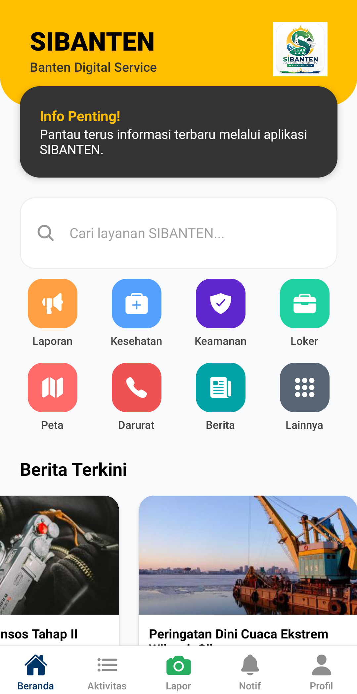

# SiBanten - Aplikasi Pelaporan Masyarakat

SIBANTEN adalah aplikasi mobile berbasis komunitas yang dirancang untuk mempermudah masyarakat Provinsi Banten dalam melaporkan masalah lingkungan dan fasilitas umum. Aplikasi ini menghubungkan masyarakat dengan instansi terkait secara transparan, cepat, dan akurat.

## 📸 Tampilan Aplikasi

Berikut adalah tampilan antarmuka dari aplikasi SiBanten:




## 🚀 Fitur Utama

- **Pelaporan Real-time**: Kirim laporan masalah lingkungan dilengkapi dengan foto dan lokasi GPS yang presisi.
- **Verifikasi NIK**: Menjamin validitas data pengguna untuk mencegah laporan palsu/hoax.
- **Monitoring Status**: Pantau tindak lanjut laporan Anda melalui notifikasi status secara _real-time_.
- **Keamanan Data**: Menggunakan enkripsi untuk melindungi data pribadi dan privasi pengguna.

## 🛠 Tech Stack

Aplikasi ini dibangun menggunakan teknologi modern untuk performa dan keamanan terbaik:

- **Frontend**: React Native, Expo
- **Backend**: Firebase Authentication (Auth), Firestore (Database)
- **Design/Prototyping**: Figma, Canva
- **Tools**: Expo Router, Firebase SDK

## 📱 Struktur Navigasi

- **(auth)**: Menangani alur login dan autentikasi pengguna.
- **(tabs)**: Navigasi utama aplikasi (Home, Aktivitas, Laporan, Notifikasi, Profile).
- **Layar Tambahan**: Edit Profil, Verifikasi NIK, Tentang Aplikasi, Syarat & Ketentuan, Kebijakan Privasi.

## 🛠 Instalasi & Pengembangan

1. Install dependencies

   ```bash
   npm install
   ```

2. Start the app

   ```bash
   npx expo start
   ```

In the output, you'll find options to open the app in a

- [development build](https://docs.expo.dev/develop/development-builds/introduction/)
- [Android emulator](https://docs.expo.dev/workflow/android-studio-emulator/)
- [iOS simulator](https://docs.expo.dev/workflow/ios-simulator/)
- [Expo Go](https://expo.dev/go), a limited sandbox for trying out app development with Expo

You can start developing by editing the files inside the **app** directory. This project uses [file-based routing](https://docs.expo.dev/router/introduction).

## Get a fresh project

When you're ready, run:

```bash
npm run reset-project
```

This command will move the starter code to the **app-example** directory and create a blank **app** directory where you can start developing.

## Learn more

To learn more about developing your project with Expo, look at the following resources:

- [Expo documentation](https://docs.expo.dev/): Learn fundamentals, or go into advanced topics with our [guides](https://docs.expo.dev/guides).
- [Learn Expo tutorial](https://docs.expo.dev/tutorial/introduction/): Follow a step-by-step tutorial where you'll create a project that runs on Android, iOS, and the web.

## Join the community

Join our community of developers creating universal apps.

- [Expo on GitHub](https://github.com/expo/expo): View our open source platform and contribute.
- [Discord community](https://chat.expo.dev): Chat with Expo users and ask questions.
